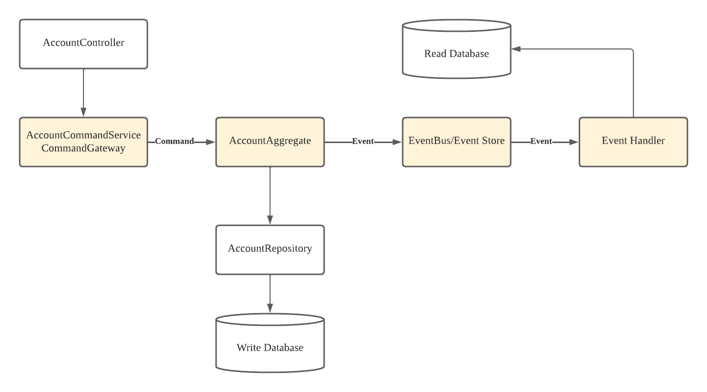

# spring-axon-cqrs

Basic Demo project for CQRS and Event Sourcing with Spring Boot and Axon Framework

Axon Framework Architectural pattern
--------





Notes
--------
### Terminologies and Axon Annotations

- **Event Sourcing** : A design pattern that captures state changes as an event. State changes are persisted as events in an Event Store.
	- Atomic Update 
	
	- Audit logging 
	
	- Recovery 
	
- **CQRS** (Command Query Responsibility Segregation): The responsibility to read and present a view of an aggregate (Query) is separated from updating the state of an aggregate (Command)

- **Command** - intent to change an object's state
	- The identifier in a command is annotated with ```@TargetAggregateIdentifier```.
	- > **Note** marked the fields in the commands as final for the message to be immuatable
- **Query** - intent to request for information of an object's state

- **Event** - object that describe something that has occurred in the application
	- > **Note** each command has a corresponding event

- **Aggregate (Command Model)**: an object with states(fields) and methods to alter those states.
	- > **Note** A no-arg constructor is required by Axon. 
	- An aggregate class is annotated with ```@Aggregate``` identifier to identify a particular instance of the Aggregate.
	- The identifier in an aggregate is annotated with ```@AggregateIdentifier```.
	- ```@CommandHandler```: Aggregate method level annotation to handle commands and event message is published using ```AggregateLifecycle.apply(Object...)``` to method annotated with ```@EventSourcingHandler```.
	- ```@EventSourcingHandler``` tells the framework that the annotated function should be called when the Aggregate is 'sourced from its events'. As all the Event Sourcing Handlers combined will form the Aggregate, this is where all the state changes happen.
	- > **Note** Aggregate Identifier must be set in the ```@EventSourcingHandler``` of the very first Event published by the aggregate. (creation event)
	
- **Event Handlers (Query Model)**: update this model based on the events propagating through the system
	- ```@Service```: class annotation for event handler
	- [```@EventHandler```](https://docs.axoniq.io/reference-guide/v/3.1/part-ii-domain-logic/event-handling): to store an event and update it

- **Query Handlers (Query Model)**
	- ```@QueryHandler```: will handle the Query

- Controller (REST Endpoint):
	- ```CommandGateway```: the mechanism to send our command messages
	- ```QueryGateway``` in turn, sends query messages. ()


#### Component 
- Command Bus: provides the mechanism of having commands routed to their respective Command Handlers. ```@CommandHandler``` annotation on Aggregate Class means that when the Command is created, your Aggregate Class's method would be called. The Command Bus is the component that makes this possible.

- Command Gateway - convenient interface towards the Command dispatching mechanism..

- Event Bus - mechanism that dispatches events to the subscribe event handlers. ```AggregateLifecycle.apply(new Event(command.getId, command.getStatus));```

- Event Store - an event bus that is able to persists published events and is able to retrieve previous events based on a given aggregate identifier (Event Bus + persistence)

Resource
--------

- [Official AxonIQ Reference Guide](https://docs.axoniq.io/reference-guide/axon-framework/introduction)
- [CQRS and Event Sourcing with Spring Boot and Axon Framework](https://www.youtube.com/watch?v=SL2VSYecDvQ)
- [A Guide to the Axon Framework](https://www.baeldung.com/axon-cqrs-event-sourcing)
- Implementing Event Sourcing With Axon and Spring Boot [P1](https://dzone.com/articles/implementing-event-sourcing-using-axon-and-spring)[P2](https://dzone.com/articles/implementing-event-sourcing-with-axon-and-spring-b)[P3](https://dzone.com/articles/implementing-event-sourcing-with-axon-and-spring-b-1)
- [Understanding the Files and Components of a CQRS Application(With AxonFramework)](https://www.kindsonthegenius.com/microservices/understanding-the-files-and-components-of-a-cqrs-applicationwith-axonframework/)

